# Personal Task Manager

## Overview

The Personal Task Manager is a web application built with the following technologies:

-   **Frontend**: Next.js, React, Shadcn UI
-   **Backend**: Python, FastAPI
-   **Database**: MongoDB
-   **Authentication**: JWT

### Project Structure

```
personal-task-manager/
├── src/                        # Frontend source code
│   ├── components/             # Reusable UI components
│   ├── pages/                  # Next.js pages
│   └── styles/                 # CSS styles
├── backend/                    # Backend source code
│   ├── routers/                # API route handlers
│   ├── models/                 # Data models
│   ├── db/                     # Database connection
│   └── auth/                   # Authentication logic
├── public/                     # Static assets
└── package.json                # Project dependencies
```

### Design Philosophy

I wanted to emphasize a clean UI that I can easily interact with from a mobile interface. The project was developed from the ground up for an iPhone 11 screen (my phone) but it should work with most modern smartphones.

I also designed it around my own personal task management strategy, where I break tasks into deadlines (1day, 7day, 30day), so that I can triage appropriately and devote my time.

I chose Shadcn because of how customizable the components are, allowing full control and modification from existing components.

## Frontend

### Shadcn UI

The project uses Shadcn UI, a collection of reusable components built with Radix UI and Tailwind CSS. These components are completely customizable and allow for a consistent design language throughout the application.

### Authentication Flow

The authentication flow begins at the login page (`login.jsx`), where users can either sign in or create a new account.

#### Login Page

The login page features:

-   A clean, responsive layout with a form on the left and promotional content on the right (desktop view)
-   A mobile-optimized view with just the essential login form
-   Form validation with helpful error messages
-   A link to the GitHub repository

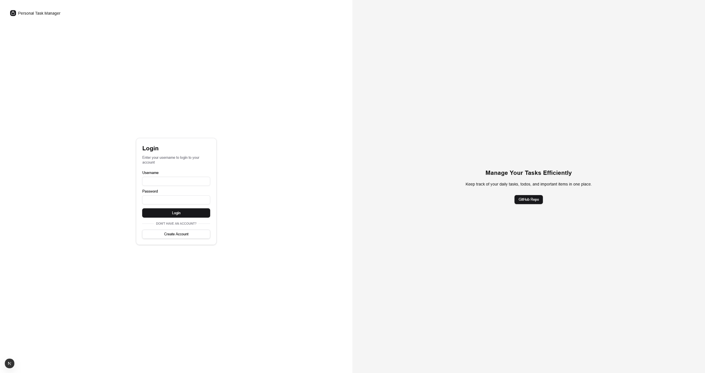

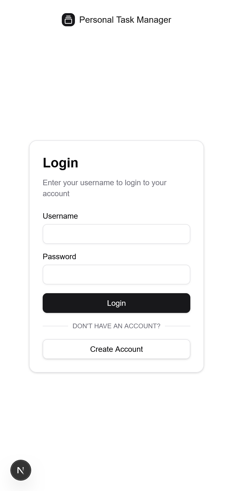

#### Authentication Process

When a user logs in:

1. Credentials are validated against the backend
2. Upon successful authentication, a JWT token is returned
3. The token is stored in localStorage
4. The user is redirected to the main page

### Main Page (Dashboard)

The main page (`index.js`) serves as the dashboard for the user's tasks.

#### View Selector

At the top of the page, users can toggle between different views:

-   **All**: Shows all tasks regardless of type
-   **Tasks**: Shows only 1-day deadline tasks
-   **Todos**: Shows only 7-day deadline tasks
-   **Gottados**: Shows only 30-day deadline tasks

This tab-based navigation makes it easy to focus on specific time horizons.

#### Hamburger Menu

Located in the bottom-right corner for easy thumb access on mobile devices, the hamburger menu provides quick access to:

-   Create new task
-   Logout
-   (Admin functions for users with admin role)

This placement ensures that crucial actions are always within reach on mobile devices.

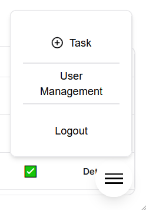

### Task Creation

The task creation dialog (`CreateTaskDialog.jsx`) allows users to add new tasks to their list.

Features include:

-   Title and description fields
-   Task level dropdown (Task - 1 day, Todo - 7 days, Gottado - 30 days)
-   Due date picker
-   Tag input (comma-separated)
-   Priority toggle
-   File attachment functionality for supporting documents or images

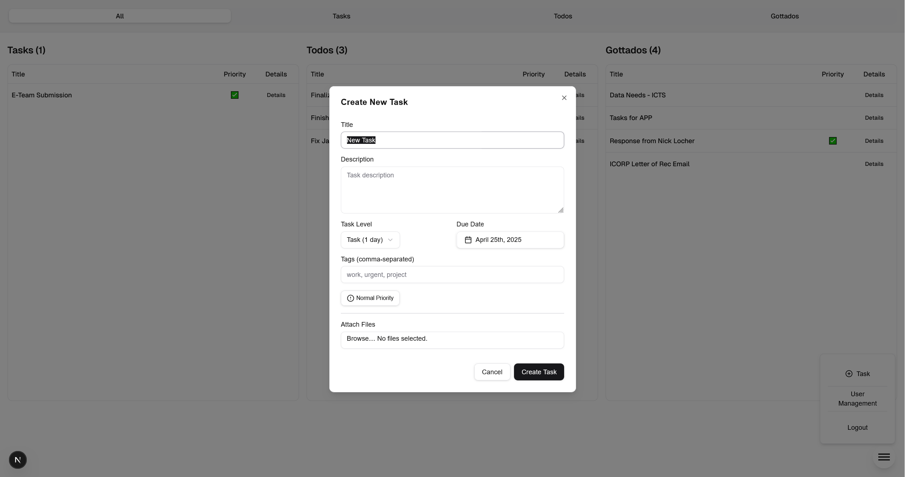

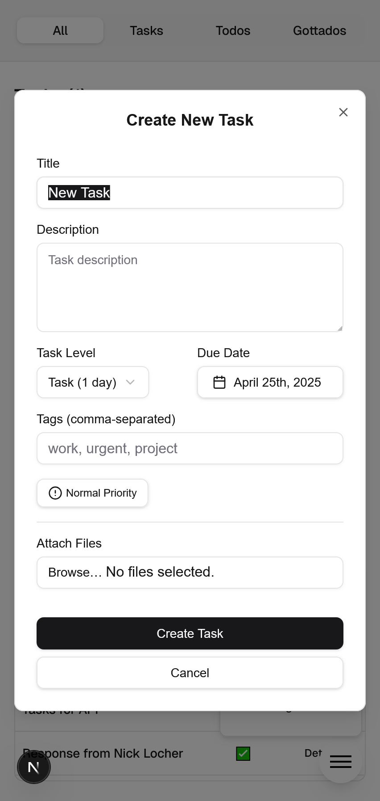

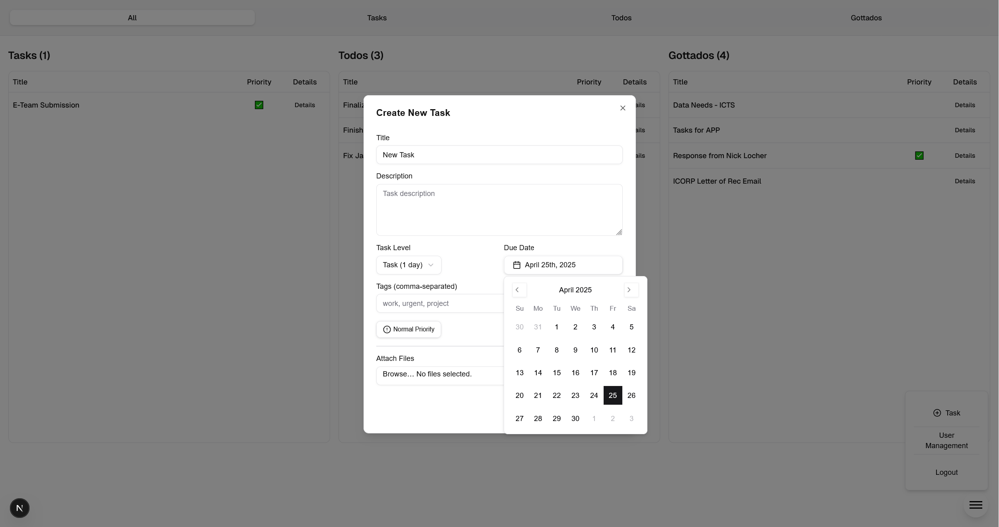

### Task Display

The main table view provides a clean, minimalist display of tasks, showing only:

-   Task title
-   Priority indicator
-   Details button

This approach ensures a clean UI that communicates essential information at a glance without overwhelming the user.

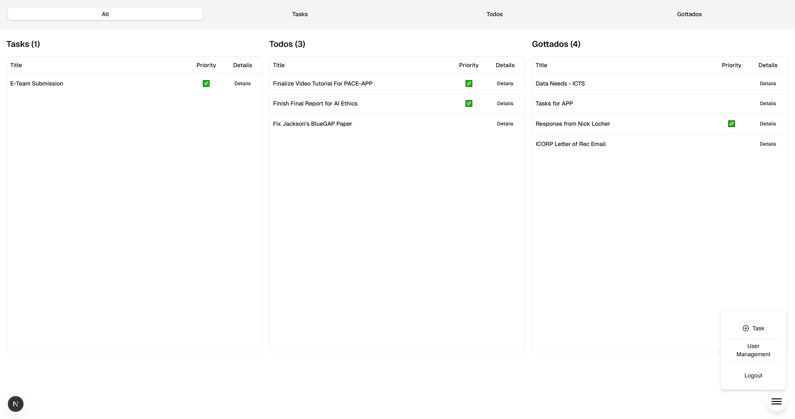

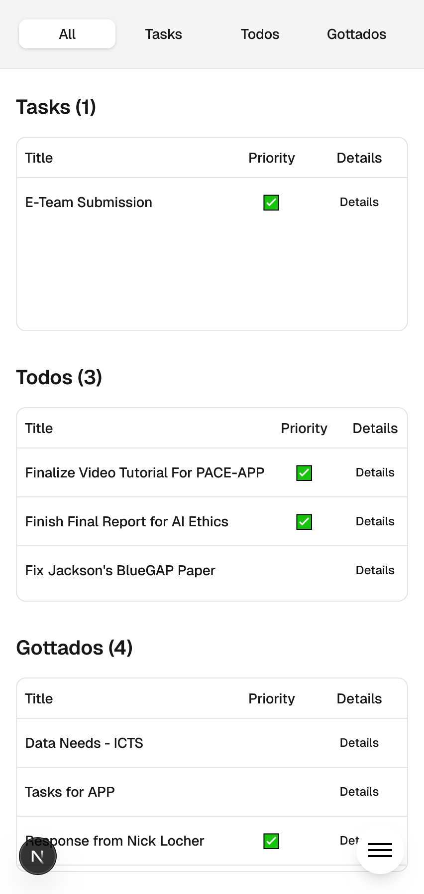

### Task Details and Editing

The task details dialog (`Todo.jsx`) provides a comprehensive view of a task's information.

#### Viewing Mode

The viewing mode displays:

-   Task title and description
-   Task level indicator
-   Date information (created, due) accessible via a popover
-   Tags associated with the task
-   Files/images attached to the task in a carousel
-   Controls for:
    -   Changing task priority
    -   Marking as complete/reopen
    -   Deleting the task
    -   Reordering the task in the list

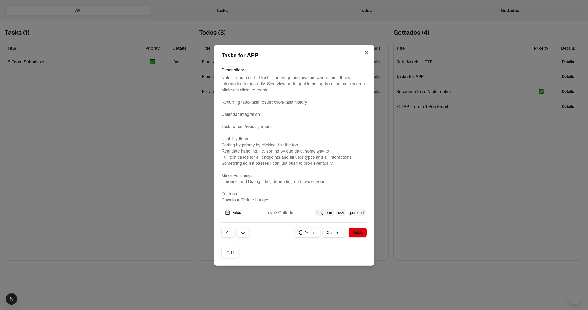

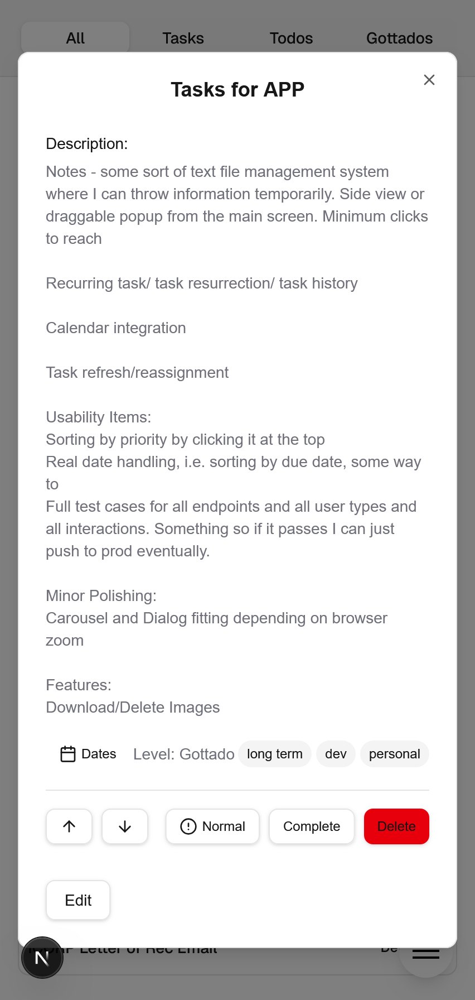

#### Editing Mode

When "Edit" is clicked, the view transforms to allow editing:

-   Input field for title
-   Textarea for description
-   Dropdown for task level
-   Save/Cancel buttons

The interface maintains the same layout while allowing modifications to these key fields.

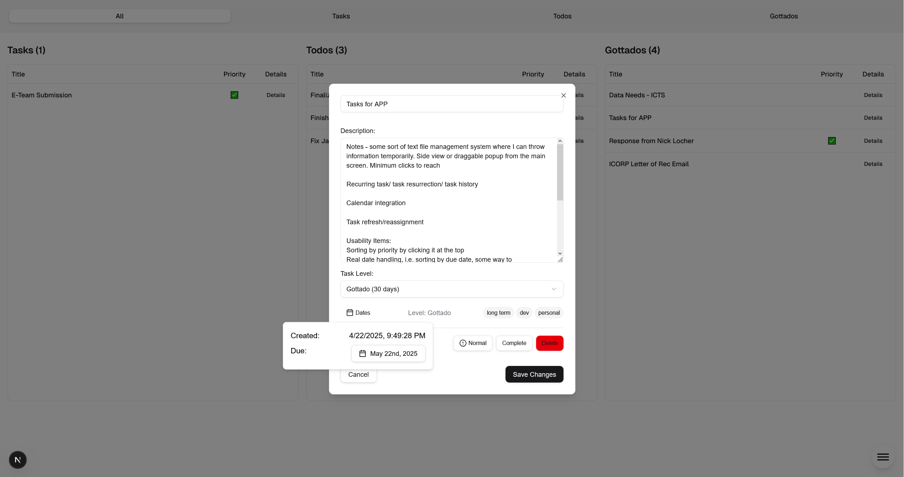

## Backend

The backend API is organized into several routers:

### User Router (`user_router.py`)

Handles user authentication, registration, and profile management.

### Task Router (`task_router.py`)

Manages CRUD operations for tasks, including:

-   Creating new tasks
-   Updating task details
-   Marking tasks as complete
-   Retrieving tasks by different filters (all, tasks, todos, gottados)

### File Router (`file_router.py`)

Handles file operations:

-   Uploading files and images
-   Retrieving files by task
-   Downloading files

### Log Router (`log_router.py`)

Manages system logs and activity tracking.

## Getting Started

[Instructions for setting up and running the project would go here]
